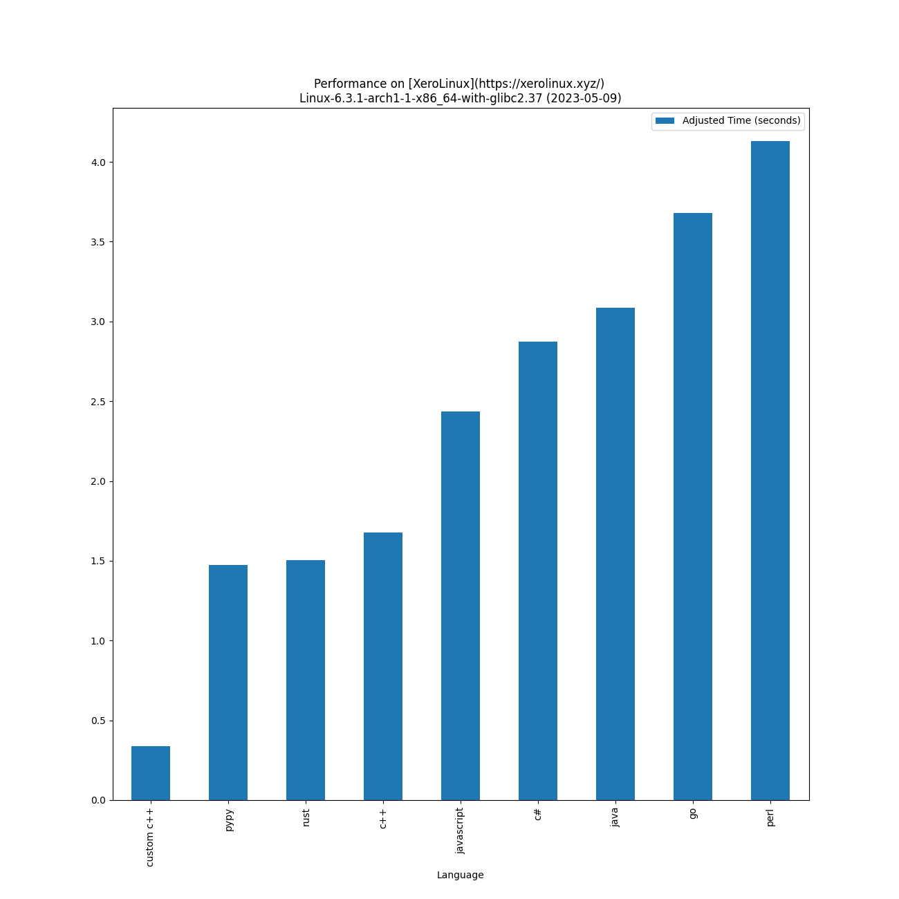
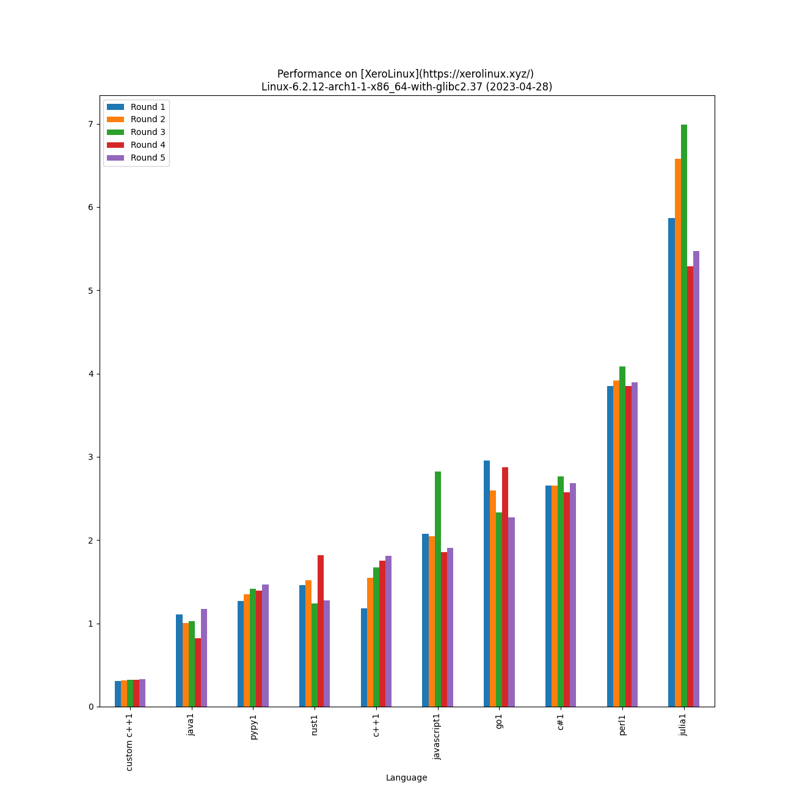
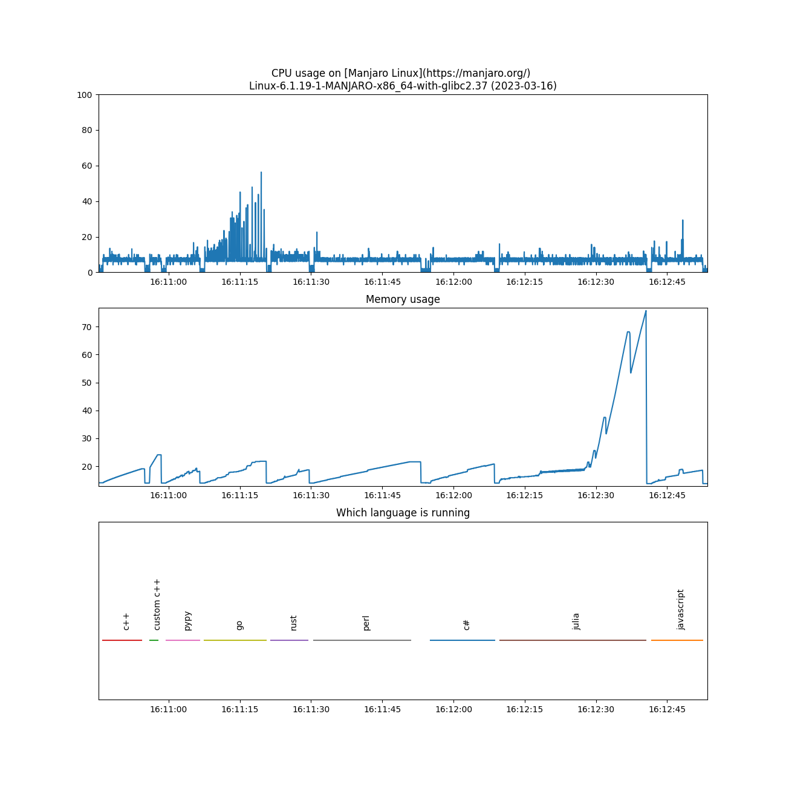

# Performance Of [Programming Languages](https://www.randomguy.info/2022/07/on-linux-and-programming-languages.html)

Lower is better - on [XeroLinux](https://xerolinux.xyz/) 
Linux-6.3.1-arch1-1-x86_64-with-glibc2.37 on 2023-05-09 with [AMD Ryzen 7 5825U with Radeon Graphics](https://www.amd.com/en/products/apu/amd-ryzen-7-5825u) and 13.5 GB of RAM memory:

|                              Language                              |                                        Version                                         | Adjusted time based on CPU usage (seconds) | Average time (seconds) | Average CPU usage (%) | Average memory usage (%) |
|:------------------------------------------------------------------:|:--------------------------------------------------------------------------------------:|:------------------------------------------:|:----------------------:|:---------------------:|:------------------------:|
|              [custom c++](https://www.randomguy.info)              |                                         (0,0)                                          |                   0.338                    |         0.316          |         6.692         |          27.967          |
|             [pypy](https://en.wikipedia.org/wiki/PyPy)             |    Python 2.7.18 (Dec 31 2022, 19:17:26)     |                   1.472                    |         1.393          |         6.602         |          22.884          |
|                 [rust](https://www.rust-lang.org/)                 |                          rustc 1.69.0 (84c898d65 2023-04-16)                           |                   1.505                    |         1.450          |         6.486         |          22.497          |
|            [c++](https://en.wikipedia.org/wiki/C%2B%2B)            |                               g++ (GCC) 13.1.1 20230429                                |                   1.676                    |         1.580          |         6.627         |          22.804          |
|       [javascript](https://en.wikipedia.org/wiki/JavaScript)       |                                        v19.9.0                                         |                   2.434                    |         2.158          |         7.050         |          23.077          |
| [c#](https://en.wikipedia.org/wiki/C_Sharp_(programming_language)) |                                        7.0.203                                         |                   2.875                    |         2.683          |         6.697         |          24.062          |
| [java](https://en.wikipedia.org/wiki/Java_(programming_language))  |                               openjdk 20.0.1 2023-04-18                                |                   3.085                    |         1.012          |         19.052        |          33.525          |
|   [go](https://en.wikipedia.org/wiki/Go_(programming_language))    |                            go version go1.20.4 linux/amd64                             |                   3.678                    |         2.580          |         8.911         |          24.178          |
|             [perl](https://en.wikipedia.org/wiki/Perl)             | This is perl 5, version 36, subversion 1 (v5.36.1) built for x86_64-linux-thread-multi |                   4.131                    |         3.950          |         6.537         |          24.003          |

[Other OS results](./results_os/)

[Distro Watch](https://distrowatch.com/)
