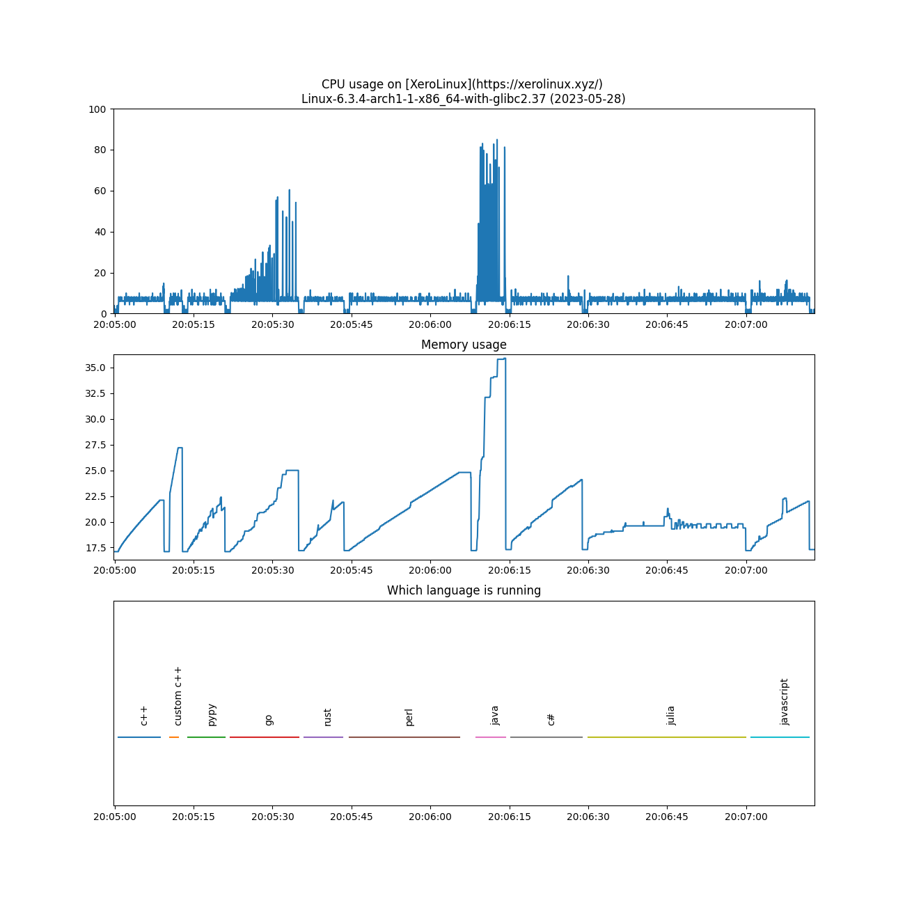

# Performance Of Programming Languages

|                               Language                              |                                        Version                                         | Adjusted time based on CPU usage (seconds) | Average time (seconds) | Average CPU usage (%) | Average memory usage (%) |
|--------|--------|--------|--------|--------|--------|
|               [custom c++](https://www.randomguy.info)              |                                         (0,0)                                          |                   0.351                    |         0.323          |           6.796           |            20.787            |
|                    [pypy](https://www.pypy.org/)                    |    Python 2.7.18 (Dec 31 2022, 19:17:26)     |                   1.506                    |         1.382          |           6.815           |            15.778            |
|  [rust](https://en.wikipedia.org/wiki/Rust_(programming_language))  |                          rustc 1.68.0 (2c8cc3432 2023-03-06)                           |                   1.614                    |         1.528          |           6.601           |            15.447            |
|             [c++](https://en.wikipedia.org/wiki/C%2B%2B)            |                               g++ (GCC) 12.2.1 20230201                                |                   1.785                    |         1.634          |           6.827           |            15.713            |
|        [javascript](https://en.wikipedia.org/wiki/JavaScript)       |                                        v19.6.0                                         |                   2.324                    |         2.123          |           6.842           |            15.258            |
|  [c#](https://en.wikipedia.org/wiki/C_Sharp_(programming_language)) |                                        7.0.202                                         |                   2.942                    |         2.698          |           6.815           |            17.016            |
|  [java](https://en.wikipedia.org/wiki/Java_(programming_language))  |                               openjdk 19.0.2 2023-01-17                                |                   3.139                    |         1.024          |           19.153          |            26.188            |
|  [go](https://go.dev/)  |                            go version go1.20.2 linux/amd64                             |                   3.723                    |         2.533          |           9.188           |            17.227            |
|              [perl](https://en.wikipedia.org/wiki/Perl)             | This is perl 5, version 36, subversion 0 (v5.36.0) built for x86_64-linux-thread-multi |                   4.201                    |         3.917          |           6.703           |            16.999            |
| [julia](https://en.wikipedia.org/wiki/Julia_(programming_language)) |                                  julia version 1.8.5                                   |                   6.457                    |         6.124          |           6.590           |            27.512            |

