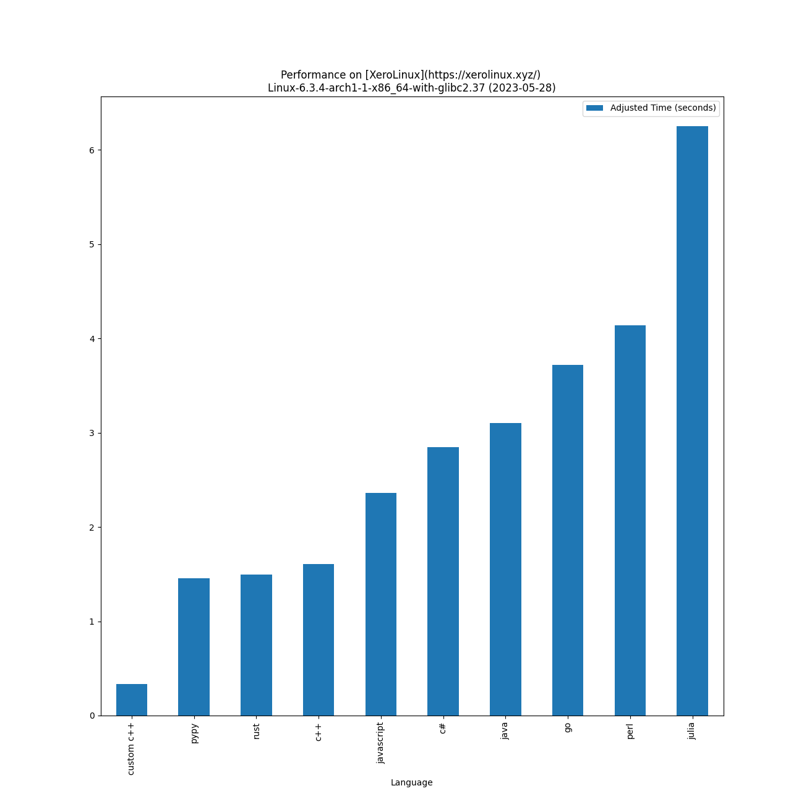

# Performance Of [Programming Languages](https://www.randomguy.info/2022/07/on-linux-and-programming-languages.html)

Lower is better - on [XeroLinux](https://xerolinux.xyz/)
Linux-6.2.12-arch1-1-x86_64-with-glibc2.37 on 2023-04-28 with [AMD Ryzen 7 5825U with Radeon Graphics](https://www.amd.com/en/products/apu/amd-ryzen-7-5825u) and 13.5 GB of RAM memory:

|                                      Language                                     |                                        Version                                         | Adjusted time based on CPU usage (seconds) | Average time (seconds) | Average CPU usage (%) | Average memory usage (%) |
|:---------------------------------------------------------------------------------:|:--------------------------------------------------------------------------------------:|:------------------------------------------:|:----------------------:|:---------------------:|:------------------------:|
|                      [custom c++](https://www.randomguy.info)                     |                                         (0,0)                                          |                   0.357                    |         0.321          |         6.953         |          21.762          |
|                     [pypy](https://en.wikipedia.org/wiki/PyPy)                    |    Python 2.7.18 (Dec 31 2022, 19:17:26)     |                   1.497                    |         1.384          |         6.756         |          16.627          |
|         [rust](https://en.wikipedia.org/wiki/Rust_(programming_language))         |                          rustc 1.69.0 (84c898d65 2023-04-16)                           |                   1.608                    |         1.469          |         6.839         |          16.356          |
|                    [c++](https://en.wikipedia.org/wiki/C%2B%2B)                   |                               g++ (GCC) 12.2.1 20230201                                |                   1.766                    |         1.630          |         6.774         |          16.615          |
|               [javascript](https://en.wikipedia.org/wiki/JavaScript)              |                                        v19.9.0                                         |                   2.471                    |         2.141          |         7.213         |          16.830          |
|         [c#](https://en.wikipedia.org/wiki/C_Sharp_(programming_language))        |                                        7.0.203                                         |                   2.960                    |         2.698          |         6.858         |          17.881          |
|         [java](https://en.wikipedia.org/wiki/Java_(programming_language))         |                               openjdk 20.0.1 2023-04-18                                |                   3.165                    |         1.128          |         17.533        |          27.919          |
| [go](https://spectrum.ieee.org/go-language-tops-list-of-indemand-software-skills) |                            go version go1.20.3 linux/amd64                             |                   3.799                    |         2.598          |         9.141         |          17.965          |
|                     [perl](https://en.wikipedia.org/wiki/Perl)                    | This is perl 5, version 36, subversion 0 (v5.36.0) built for x86_64-linux-thread-multi |                   4.306                    |         3.908          |         6.886         |          17.856          |
|        [julia](https://en.wikipedia.org/wiki/Julia_(programming_language))        |                                  julia version 1.8.5                                   |                   6.542                    |         6.033          |         6.777         |          29.109          |

[Other OS results](./results_os/)

[Distro Watch](https://distrowatch.com/)
