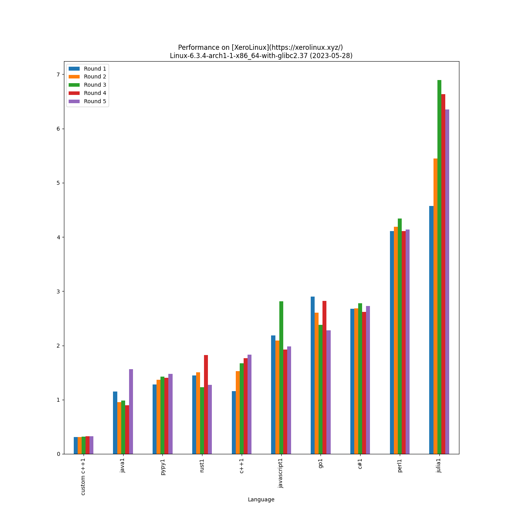

# Performance Of [Programming Languages](https://www.randomguy.info/2022/07/on-linux-and-programming-languages.html)

Lower is better - on [XeroLinux](https://xerolinux.xyz/) 
Linux-6.3.4-arch1-1-x86_64-with-glibc2.37 on 2023-05-28 with [AMD Ryzen 7 5825U with Radeon Graphics](https://www.amd.com/en/products/apu/amd-ryzen-7-5825u) and 13.5 GB of RAM memory:

|                              Language                              |                                        Version                                         | Adjusted time based on CPU usage (seconds) | Average time (seconds) | Average CPU usage (%) | Average memory usage (%) |
|:------------------------------------------------------------------:|:--------------------------------------------------------------------------------------:|:------------------------------------------:|:----------------------:|:---------------------:|:------------------------:|
|              [custom c++](https://www.randomguy.info)              |                                         (0,0)                                          |                   0.333                    |         0.318          |         6.544         |          24.967          |
|             [pypy](https://en.wikipedia.org/wiki/PyPy)             |    Python 2.7.18 (Dec 31 2022, 19:17:26)     |                   1.457                    |         1.391          |         6.548         |          19.871          |
| [rust](https://en.wikipedia.org/wiki/Rust_(programming_language))  |                          rustc 1.69.0 (84c898d65 2023-04-16)                           |                   1.496                    |         1.456          |         6.422         |          19.655          |
|            [c++](https://en.wikipedia.org/wiki/C%2B%2B)            |                               g++ (GCC) 13.1.1 20230429                                |                   1.604                    |         1.570          |         6.388         |          19.914          |
|       [javascript](https://en.wikipedia.org/wiki/JavaScript)       |                                        v20.2.0                                         |                   2.360                    |         2.204          |         6.693         |          19.481          |
| [c#](https://en.wikipedia.org/wiki/C_Sharp_(programming_language)) |                                        7.0.302                                         |                   2.846                    |         2.696          |         6.598         |          21.210          |
| [java](https://en.wikipedia.org/wiki/Java_(programming_language))  |                               openjdk 20.0.1 2023-04-18                                |                   3.101                    |         1.110          |         17.464        |          31.237          |
|                       [go](https://go.dev/)                        |                            go version go1.20.4 linux/amd64                             |                   3.717                    |         2.570          |         9.041         |          21.299          |
|             [perl](https://en.wikipedia.org/wiki/Perl)             | This is perl 5, version 36, subversion 1 (v5.36.1) built for x86_64-linux-thread-multi |                   4.140                    |         4.085          |         6.334         |          21.036          |
|                  [julia](https://julialang.org/)                   |                                  julia version 1.9.0                                   |                   6.253                    |         5.964          |         6.553         |          19.446          |

[Other OS results](./results_os/)

[Linux Kernel](https://kernel.org/)

[Distro Watch](https://distrowatch.com/)

